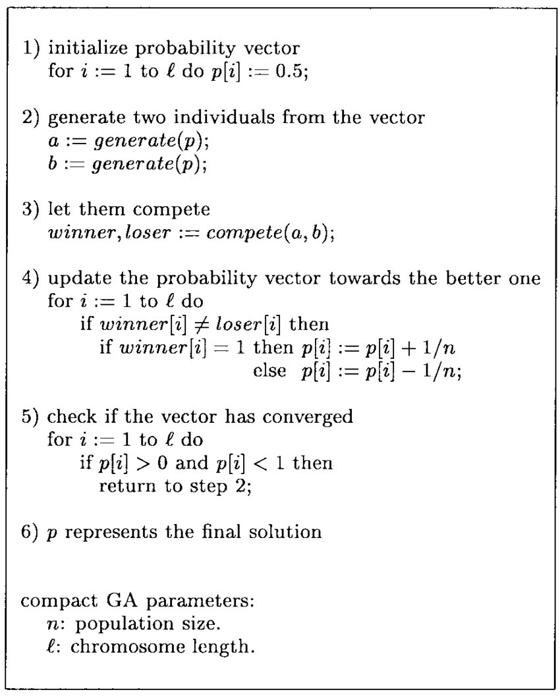
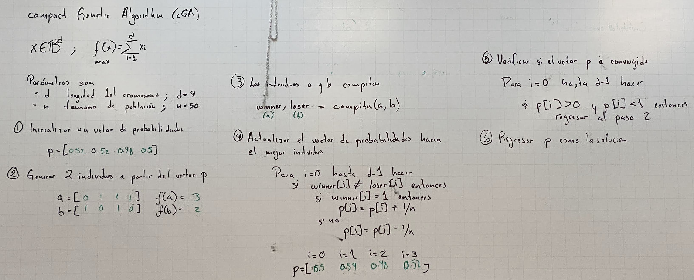

# Compact Genetic Algorithm (CGA)

The Compact Genetic Algorithm (CGA) is a variant of the genetic algorithm used for optimization and solution search in complex problems. Unlike conventional genetic algorithms, the CGA uses a compact representation of chromosomes, which means it employs a reduced number of genes compared to other approaches.

In the CGA, instead of representing every possible value in a chromosome, probability tables are used for each gene. These tables contain probability values that indicate the likelihood of a gene taking a particular value. By using these probabilities instead of binary or integer representations, the CGA can significantly reduce the size of chromosomes and the search space.

## Algorithm Steps

The basic operation of the CGA involves the following steps:

1. **Initialization**: An initial population of chromosomes with random probability tables is created.
2. **Evaluation**: The fitness of each chromosome is evaluated based on the quality of the solution it represents.
3. **Selection**: The fittest chromosomes are selected for reproduction and to form the next generation.
4. **Update of Probability Tables**: The probability tables of the genes are updated based on the performance of the selected chromosomes.
5. **Convergence**: The evaluation, selection, and probability table update steps are repeated until a convergence criterion is met, such as a maximum number of generations or a desired solution quality.

The CGA offers advantages in terms of memory usage and runtime efficiency, as the reduced chromosome size and compact representation enable more efficient exploration of the search space.

## Advantages

- **Memory Efficiency**: Reduced chromosome size leads to lower memory usage.
- **Runtime Efficiency**: Compact representation allows faster processing.
- **Effective Search Space Exploration**: Probability tables provide a flexible mechanism for navigating the search space.

## CGA Board Example

## References

- Goldberg, D. E., & Harik, G. (1998). "The Compact Genetic Algorithm." Proceedings of the IEEE International Conference on Evolutionary Computation.
- Pelikan, M., Goldberg, D. E., & Lobo, F. G. (1999). "A Survey of Optimization by Building and Using Probabilistic Models."
